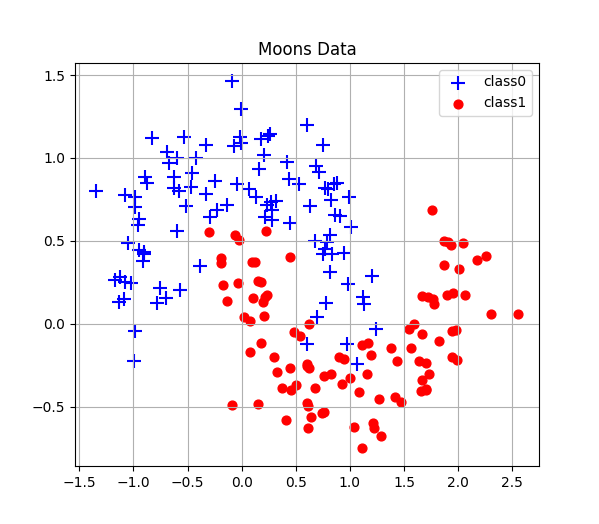

# Q1 Two Moons
### Use a neural network to find the partitioning criteria for s two moons dataset generated by sklearn package.

[//]: # ()

[//]: # (![图片1]&#40;./Figure1_MoosData.png "MoosData"&#41;)
[//]: # (![图片3]&#40;./Figure3_LinearPredict.png "Boundary"&#41;)

## 1 Our code
### `model.py`
> `LogicNet` : The neural network model.
### `utils.py`
> `show_moons()` : Plot two moons data.                                                                                                                                                                                              
> 
> 
> `moving_average()` : Smooth loss history with a certain step.
> 
>  `plot_loss()` : Plot loss history after smoothing.
> 
> `plot_decision_boundary()` : Draw result boundary.
> 
### `main.py`
> `data_loader` : Generate and load data from sklearn.
> 
> `model_instance`: Instantiate the model LogicNet.
> 
> `train`: Set the parameters and train the model.
> 
> `predict and evalate`: Do prediction with the trained model and evaluate the accuracy.
>
## 2 Our model LogicNet
> It's a fully connected neural network with only 1 hidden layer.

## 3 Run
> Run `main.py`.
> 
> Below gives a loss history example.
> 

[//]: # (![图片2]&#40;./Figure2_Loss.png "Loss"&#41;)

## 4 Tips
> 1. Comment out `os.environ['CUDA_VISIBLE_DEVICES'] = '0'`, if you use cpu only.
> 2. About Markdown (grammar of `.md`)  see <https://markdown.com.cn/>.
> 
